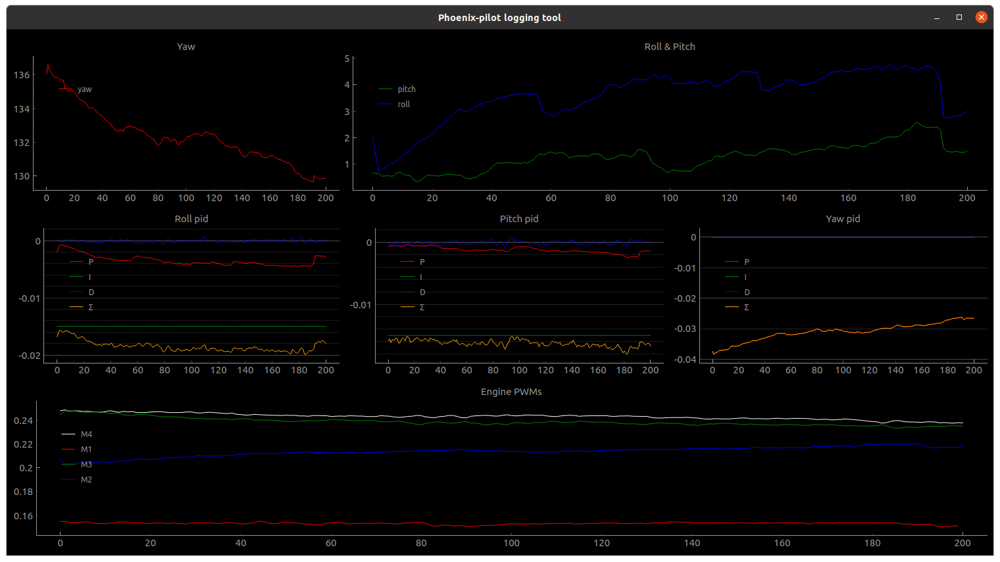

# quadLive.py plotting utility

This utility allows live plotting of data from `quad-control` application. It is a script written in python that utilizes [PyQtGraph](https://www.pyqtgraph.org/) library.



This script reads logs from the serial port and plots them accordingly. If port is opened in other application issues can arise in both `quadLive.py` and other serial port client.

# Running

```bash
# Run quadLive.py on /dev/ttyUSB1 serial device
python3 quadLive.py /dev/ttyUSB1
```

# Known issues

Closing `quadLive.py` can be cumbersome when there is no input from serial port (e.g when the flight stops). The well tested way and order for closing this app is:
 1) click (X) in the application bar
 2) `ctrl+c` in the terminal from which the app was run

 This ensures the least problematic closing.