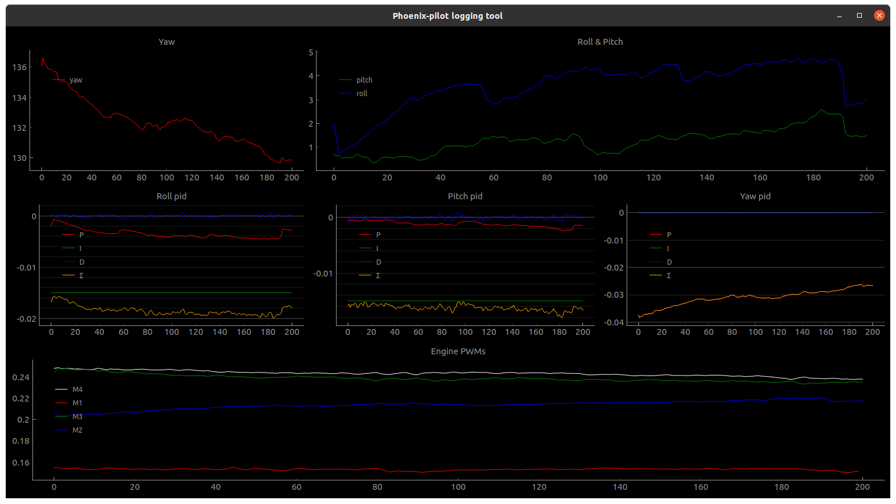

# quadLive.py plotting utility

This utility allows live plotting of data from `quad-control` application. It is a script written in python that utilizes [PyQtGraph](https://www.pyqtgraph.org/) library.



This script reads logs from the serial port and plots them accordingly. If port is opened in other application issues can arise in both `quadLive.py` and other serial port client.

# Running

Install dependencies:
```bash
pip install -r requirements.txt
```

Run quadLive.py on /dev/ttyUSB1 serial device
```bash
python3 quadLive.py /dev/ttyUSB1
```
